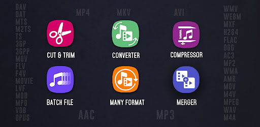

# <a>Video Converter</a>

👉 **4.7596154** User ratings

👉 **10,000,000++** installs

Batch Convert, Compress Video to MP4, MP3, 3GP, MKV, AVI, MOV, MTS, WMV, VOB,AAC

# <a>Shatkora - E-Commerce</a>

👉 **4.4** User ratings

👉 **1,000++** installs

Get the best offer and discounts on Grocery, Baby care, cosmetics etc shopping.

# <a>Video Compressor</a>

👉 **4.841424** User ratings

👉 **1,000,000++** installs

Compress Video without quality loss. Convert Video, Change resolution & Bitrate

# <a>Video Merger</a>

👉 **4.64** User ratings

👉 **500,000++** installs

Merge videos of any format and number. Also change Scale, resolution and format.

# <a>Imaage Compressor</a>

👉 **4.327273** User ratings

👉 **100,000++** installs

Batch Photo Compressor, compress image to Fixed Size KB, MB, Quality, Resolution

# <a>Video Downloader</a>

👉 **0** User ratings

👉 **5,000++** installs

Download unlimited videos directly from the internet to your device 100% free.

